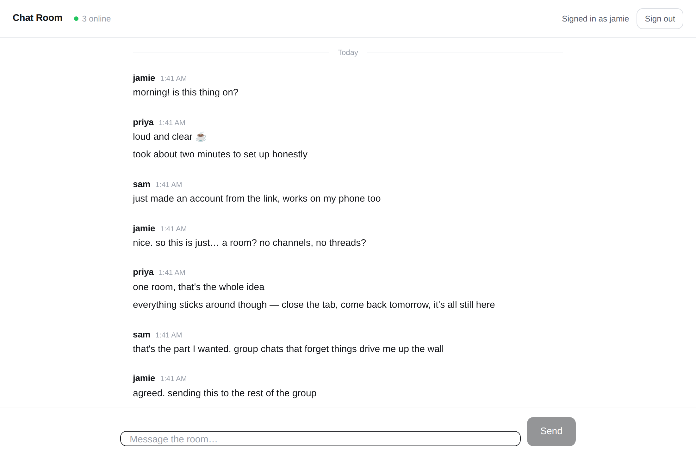

# Chat Room

A small, persistent chat room. Share the link, anyone can make an account, and
everyone talks in the same room. Nothing is lost between visits.



There are two ways to run it, and they share the same look and feel:

| | Where it runs | Backend | Cost |
| --- | --- | --- | --- |
| **Static** (`web/`) | GitHub Pages | Supabase | Free |
| **Self-hosted** (`server.js`) | Any Node host | Built in, SQLite | Depends on host |

The static build is the one deployed to GitHub Pages. Pages only serves files —
it cannot run a server — so accounts, storage, and realtime come from Supabase
instead.

## What it does

- **Accounts** — email + password, plus a display name shown in the room.
- **One shared room** — everyone who signs up lands in the same conversation.
- **Persistent history** — every message is stored and reloaded when you come
  back. Scroll up to page through older messages.
- **Live** — messages arrive over a WebSocket, with a list of who's online.
- **Minimalist white theme** — no dark mode, no clutter, works on phones.

---

## Deploying to GitHub Pages

### 1. Set up the database

In your Supabase project, open the **SQL Editor** and run
[`supabase/schema.sql`](supabase/schema.sql). It creates the tables, the
security policies, and the triggers, and it's safe to run more than once.

Worth knowing about what that file sets up:

- **Row level security is on for both tables.** Only signed-in users can read
  the room, and the policy for sending requires `auth.uid() = user_id`, so
  nobody can post as someone else.
- **There are no update or delete policies.** With RLS enabled that means
  messages cannot be edited or removed through the API at all.
- **The author is stamped by a trigger**, not by the browser. Whatever a client
  puts in the `username` column is overwritten with the real profile name.
- **Rate limiting lives in the database** — 10 messages per 10 seconds per
  person, since there's no server in front of it to enforce that.

### 2. Point the app at your project

Put your project URL and **publishable** (anon) key in
[`web/config.js`](web/config.js). Both are meant to be public — the key grants
nothing on its own, because the policies above decide what's allowed.

Never put a `service_role` or `sb_secret_...` key in that file. Those bypass
every policy, and everything in `web/` is served to the world.

### 3. Let people in without an email round-trip

By default Supabase makes new users confirm their email before they can sign in.
For a room you're sharing with friends that's usually friction you don't want:
in the dashboard go to **Authentication → Providers → Email** and turn off
**Confirm email**. New accounts then work immediately.

If you leave confirmation on, set **Authentication → URL Configuration → Site
URL** to your Pages URL so the confirmation link comes back to the right place.
The app handles both cases — it tells people to check their email when there's
no session yet.

### 4. Turn on Pages

In the repository, go to **Settings → Pages** and set **Source** to **GitHub
Actions**. Then [`.github/workflows/pages.yml`](.github/workflows/pages.yml)
publishes `web/` on every push to `main` that touches it.

The room lands at `https://<your-username>.github.io/Chat-Room/`. That's the
link you send people.

**If Source is left on "Deploy from a branch"** the site still works, because
the root [`index.html`](index.html) redirects to `web/`. Without that file
GitHub builds the repository with Jekyll and turns `README.md` into the
homepage — which looks exactly like a failed deploy. `.nojekyll` switches that
processing off.

Worth knowing: in branch mode GitHub runs its own *pages build and deployment*
job alongside this workflow, and whichever finishes last wins. If the site keeps
reverting to the README, that race is why — switching Source to GitHub Actions
stops the other job from running at all.

### A note on the vendored library

`web/vendor/supabase.js` is a committed copy of `supabase-js` rather than a CDN
`<script>`. The page then has no third-party request on load, so it doesn't
break if a CDN is blocked or goes down. To update it:

```bash
npm pack @supabase/supabase-js
# unpack and copy dist/umd/supabase.js over web/vendor/supabase.js
```

---

## Running the self-hosted version

The original Node build is still here and needs no external service — it keeps
accounts, messages, and sessions in one SQLite file.

```bash
npm install
npm start
```

Open <http://localhost:3000>, create an account, and start typing. Open a second
browser to watch messages sync. Use `npm run dev` for auto-reload.

To deploy it, the only real requirement is **persistent disk**. The database
lives in `DATA_DIR` (default `./data`); point that at a mounted volume and the
room survives redeploys.

- **Render** — `render.yaml` sets it up, disk included. New → Blueprint → pick
  the repo. The persistent disk needs a paid plan; on the free tier the app runs
  but resets when the instance recycles.
- **Docker** — `docker build -t chat-room . && docker run -p 3000:3000 -v chat-data:/data chat-room`
- **Anywhere else** — Node 18+, set `DATA_DIR` to a persistent path, set
  `NODE_ENV=production`, and put it behind HTTPS.

### Configuration

| Variable | Default | Notes |
| --- | --- | --- |
| `PORT` | `3000` | Port to listen on. |
| `DATA_DIR` | `./data` | Where `chat.db` is written. Mount a volume here. |
| `NODE_ENV` | — | Set to `production` to mark cookies `Secure` (requires HTTPS). |
| `SESSION_SECRET` | auto-generated | Signs session cookies. Generated once and stored in the database if unset, so sessions survive restarts either way. Set it explicitly if you run more than one instance. |

---

## Layout

```
web/              static build deployed to GitHub Pages
  app.js          client logic — auth, history, realtime
  config.js       your Supabase URL and publishable key
  vendor/         committed supabase-js bundle
supabase/
  schema.sql      tables, RLS policies, triggers
server.js         self-hosted version: routes, auth, sockets
db.js             SQLite schema and prepared statements
session-store.js  express-session store on the same SQLite file
public/           frontend for the self-hosted version
```

## Security notes

Shared by both builds:

- Message text is rendered with `textContent` and links are built as DOM nodes,
  so posted HTML shows up as literal text instead of executing.
- Sending is rate-limited per user.
- Nobody can post under another person's name — the server (or the database
  trigger) decides the author.

Self-hosted only:

- Passwords are bcrypt-hashed (cost 12) and never returned by the API.
- Login timing is constant-ish whether or not the account exists, so the form
  doesn't leak which emails are registered.
- Session cookies are `httpOnly`, `SameSite=Lax`, and `Secure` in production.
- State-changing requests must be `application/json`, which blocks simple
  cross-site form posts.

Anyone with the link can register — that's the point, but it does mean the room
is public. To lock it down, add an invite code check to the sign-up path, or
restrict sign-ups by email domain in the Supabase dashboard.

## License

MIT
